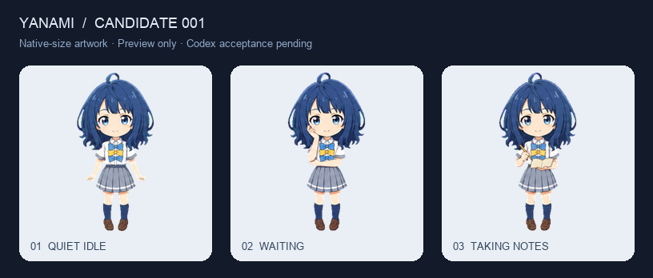

# Yanami · Codex 原生桌宠精修

让八奈见杏菜在 Codex 里保持原来的样子，同时拥有更稳定的脸型、更自然的动作和可重复检查的制作流程。

**当前状态：candidate-001 已构建并安装到本机，等待真实 Codex 反馈。** 第三轮回到原版参考，完成真正的透明背景、统一尺度与三个状态的精修；17 项制作工具测试和 6 项时序测试通过。尚未宣称完成实机验收或正式发布。当前精确状态见 [project-status.json](reviews/project-status.json)，本轮记录见 [candidate-001](reviews/candidate-001/review.md)。



前两轮因背景和角色一致性问题退回，保留[第一轮](reviews/iteration-01.md)、[独立视觉审阅](reviews/visual-iteration-01.md)与[第二轮](reviews/iteration-02.md)记录。第三轮的完整参数、提示词和处理步骤见[制作流程](docs/制作流程.md)。

这一版优先精修待机、等待和工作三个状态；是否适合长期使用，要以预览审阅和真实 Codex 验收为准。自动检查通过、成功安装，都不等于视觉验收通过。验收记录统一保存在 `reviews/`，没有记录的项目视为未验收。

本项目输出 Codex 原生 `pet.json` 与 WebP 图集，保持既有角色和原生行为格式。它不提供独立桌宠引擎、自由对话、喂食或养成系统。

## 从哪里开始

- 想看效果：打开[本地预览](#预览)，在原版与候选版之间比较。
- 想制作素材：先读[设计与六帧分镜](docs/design.md)，再按[验收标准](docs/acceptance.md)检查。
- 想放进 Codex：完成自动检查与视觉审阅后，按[安装与实际验收](#安装与实际验收)操作。
- 想继续发展：[后续路线](docs/roadmap.md)与[参考研究](docs/research.md)。

## 仓库内容

| 路径 | 用途 |
|---|---|
| `assets/upstream/yanami-anna/` | 上游原版图集、配置与历史校验报告 |
| `pets/yanami-anna-refined/` | 构建生成的候选宠物包 |
| `tools/pet_tool.py` | 构建、结构检查与安装工具 |
| `preview/` | 原版/候选对照、原生播放与逐帧审阅 |
| `docs/` | 设计、验收、路线与研究依据 |
| `reviews/` | 每轮真实结果、问题、证据与最终决定 |

## 制作与构建

需要 Python 3，图像依赖由 `requirements.txt` 声明。建议在仓库内建立独立环境，再查看工具帮助：

```bash
python3 -m venv .venv
source .venv/bin/activate
python3 -m pip install -r requirements.txt
python3 tools/pet_tool.py --help
python3 tools/pet_tool.py build --help
```

用上游素材重建一个基线包，可检查整个制作流程；这一步本身不会让画面变得精致：

```bash
python3 tools/pet_tool.py build \
  --base assets/upstream/yanami-anna/spritesheet.webp \
  --output work/baseline-check
```

三个精修状态分别使用一张 **3 列 × 2 行的六帧透明 PNG**，按先左到右、再上到下读取。仓库已保存 candidate-001 的原生尺寸素材，以下命令重建本轮候选。已被退回的生成稿不能直接用于候选构建：

```bash
python3 tools/pet_tool.py build \
  --base assets/upstream/yanami-anna/spritesheet.webp \
  --output pets/yanami-anna-refined \
  --replace idle assets/source/iteration-03-native/idle.png 3x2 \
  --replace waiting assets/source/iteration-03-native/waiting.png 3x2 \
  --replace running assets/source/iteration-03-native/running.png 3x2 \
  --fit native
```

工具保留其余状态的基线素材，按本次核对的 Codex v2 帧数清空不用的格子。默认 `--fit contain` 按源格比例适配；已经制作为每格 192 × 208 的素材可使用 `--fit native`。不能依靠逐帧随意缩放掩盖人物比例不一致。

构建产物包括 `pet.json`、`spritesheet.webp` 与 `validation.json`。修改素材后重新构建和检查，不手工把旧报告复制到新包里。

```bash
python3 tools/pet_tool.py validate pets/yanami-anna-refined \
  --json reviews/current-validation.json
```

`reviews/current-validation.json` 是便于当前查看的报告。每次正式审阅还需按[记录规则](docs/acceptance.md#每轮审阅记录)存一份带候选编号的结果，避免下一轮覆盖证据。

## 预览

在仓库根目录运行：

```bash
python3 -m http.server 8765 --bind 127.0.0.1
```

打开 [Yanami 预览](http://127.0.0.1:8765/preview/)。详细操作见 [preview/README.md](preview/README.md)。

依次检查原版/候选对照、深浅背景、实际小尺寸、暂停逐帧和原速播放。预览的“原生播放”按已核对的本机时序模拟；“循环审阅”和慢放用于找问题，不代表 Codex 会永久播放该动作。真正的宿主加载、缓存、交互与状态触发仍需实际验收。

## 安装与实际验收

检查合格后，把候选包复制到独立的宠物目录：

```bash
python3 tools/pet_tool.py install pets/yanami-anna-refined
```

默认候选安装目录是 `~/.codex/pets/yanami-anna-refined`。安装工具会核对内容并备份已存在的候选包；它不会替你在 Codex 中选中宠物，也不覆盖原版的目录。

本次操作环境的安全工具限制了自动控制 Codex 界面，因此最后一步需要用户手动完成：在 Codex 设置中的 Mini / My pets 选择 **八奈见杏菜·精修**，必要时刷新列表，再显示 Mini。不同版本入口名称可能不同，以实际界面为准。

请按[真实 Codex 检查表](docs/acceptance.md#第三层真实-codex-验收)记录看到的状态、问题和截图或短录屏。候选未在 Codex 中完成验收前，版本继续标为 **candidate**；发现脸型漂移、动作跳变或白边就退回修改。若要回退，在宠物列表重新选择原来的“八奈见杏菜”；卸载候选并非回退的必要步骤。

## 来源与许可

基于 [whileingaa/codex-pets-Yanami](https://github.com/whileingaa/codex-pets-Yanami) 的固定源码快照制作。上游未发现明确的仓库级许可证；本仓库不会替原作者或角色权利人授予第三方素材许可。上游来源、基线文件与新工具的许可状态见 [THIRD_PARTY.md](THIRD_PARTY.md)。
