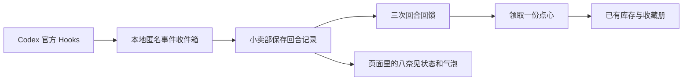

# Codex 工作联动 v0.2

本期把 Codex 工作事件接入现有小卖部，保留原版八奈见图集与动作时序。小卖部中的八奈见会随工作/等待事件切换已有动作、气泡；原生 Codex Pet 的菜单、气泡与窗口没有被修改。

## 规则与交互

- 新增独立“Codex 协作采购”卡片，不替换手动 15/25/45 分钟采购。
- 收到同一主回合的 UserPromptSubmit、PostToolUse 和 Stop，记一次回合回馈；每 3 次产生一份固定点心结果，点击领取才入库。
- Stop 是收尾信号，其他 Hook 仍可能让 Codex 继续，因此不把它解释成任务完成或测试通过。忽略 stop_hook_active=true 的重复续跑收尾；不注册 SubagentStop。
- 没有工具活动或没有起始事件的回合不记数。先收到 Interrupt 的回合永久不记数；已按第一次有效 Stop 记下的回馈保持不变，后续重复终止不撤回或追加。
- 支持不同会话并行。状态优先显示等待决定，再显示工作；超过 10 分钟未更新的活动回合显示“暂未收到新动态”，不自动完成或累计时间。
- 协作采购的小票 mode=codex、focusMinutes=0；领取、投喂、收藏及小票沿用原有保存和操作重试规则。

## 数据路径

Hook 只投递本地文件，不要求小卖部当时在线。适配器将输入裁剪成 schemaVersion、id、kind、sessionId、turnId、at；标识取 SHA-256，不保存提示词、聊天正文、工作路径、工具名称、参数或结果，不读取聊天历史。

收件箱默认是 `~/Library/Application Support/YanamiSnackClub/codex-events`。处理器静默退出，不改变工具批准、提示词或 Codex 续跑决策。服务每 2 秒消费，网页每 5 秒刷新。先提交存档再删除收件文件，掉线、重启及重复提交不会重复发奖。异步工具事件晚于 Stop 到达时可以补齐该回合；同时间事件先处理 Interrupt。单次最多提交 1000 条，先对全部候选排序。

## 存档兼容

主存档升级为 schemaVersion=2，新加独立 codex 记录；工作事件使用独立 revision，避免频繁事件挤掉用户领取/投喂的 128 条重试记录。首次从 v1 迁移会保留原始字节文件 `state.json.v1-*`。未来未知版本直接拒绝打开，不用旧备份覆盖。新版本支持旧存档；旧程序不应继续写入 v2 存档。

## 安装、审核与首次真实验证

1. 构建并更新小卖部：`npm run mac:build`；退出旧小卖部后打开新应用，同一数据文件只运行一个服务。
2. `npm run codex:install -- --dry-run` 检查配置，再 `npm run codex:install`。安装器仅合并自己的七个条目、备份已有文件，不修改 Codex 应用和信任数据库。
3. 在本仓库目录启动 Codex CLI。首次启动可能先询问是否信任此目录；本次探测停在该询问，没有代替用户确认。官方文档要求在 Codex CLI 的 `/hooks` 界面审核并信任准确的处理器定义。选择标为 `Yanami Snack Club · minimal activity event v1` 的本项目条目；无需信任其它来源。代码更新改变脚本路径后需要重新审核。
4. 在已加载新配置的 Codex 会话执行一个含工具活动的回合，确认小卖部最后更新时间发生变化、回合计数增加；至少 3 个有效回合后领取一次。
5. 检查库存增加 1、小票标协作采购、累计专注分钟不变。重复刷新/确认不能再增加库存。

当前本机 CLI 已确认 hooks 功能为 stable/true。桌面应用的实际事件投递仍以第 4 步结果为准，不能由 CLI 功能开关或模拟事件推断通过。

移除连接：`npm run codex:uninstall`。只移除本项目条目及安装标记，保留原有其它 Hooks、信任记录、内容寻址代码和零食存档。

## 依据与限制

- [官方 Hooks 文档](https://learn.chatgpt.com/docs/hooks)：事件、异步处理、信任审核及 Stop 语义。
- [官方 Pets 文档](https://learn.chatgpt.com/docs/pets)：原生桌宠能力与外观定制。
- 本地失败、进程被强制终止、输入超过 1 MiB、Hook 未获信任或被管理员禁用都可能没有事件。缺失数据不自动补奖。
- 此功能是本地陪伴反馈，不是精确工时统计、反作弊积分系统或工作成果判定。当前没有发现可直接给原生 Pet 添加交互的公开接口。
